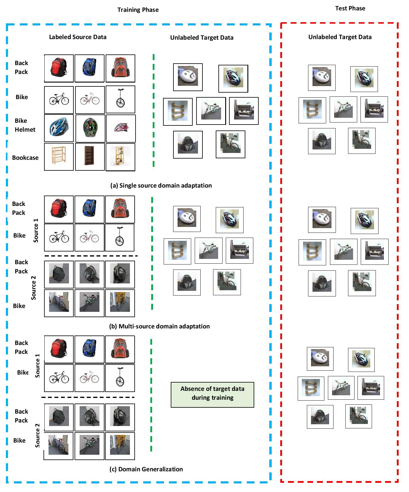
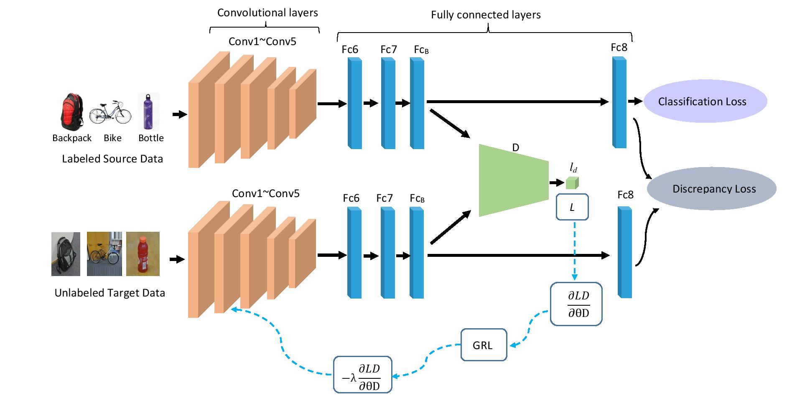

# Correlation-aware Adversarial Domain Adaptation and Generalization

The Link of the paper [Paper in Pattern Recognition](https://www.sciencedirect.com/science/article/pii/S003132031930425X).

The Link of the paper [Pre-print in arxiv](https://arxiv.org/abs/1911.12983).

## Difference between Domain Adaptation and Domain generalization


## Network Architecture



## Citation

```
@article{RAHMAN2019107124,
title = "Correlation-aware Adversarial Domain Adaptation and Generalization",
journal = "Pattern Recognition",
year = "2019",
issn = "0031-3203",
doi = "https://doi.org/10.1016/j.patcog.2019.107124",
url = "http://www.sciencedirect.com/science/article/pii/S003132031930425X",
author = "Mohammad Mahfujur Rahman and Clinton Fookes and Mahsa Baktashmotlagh and Sridha Sridharan",
} 
```
